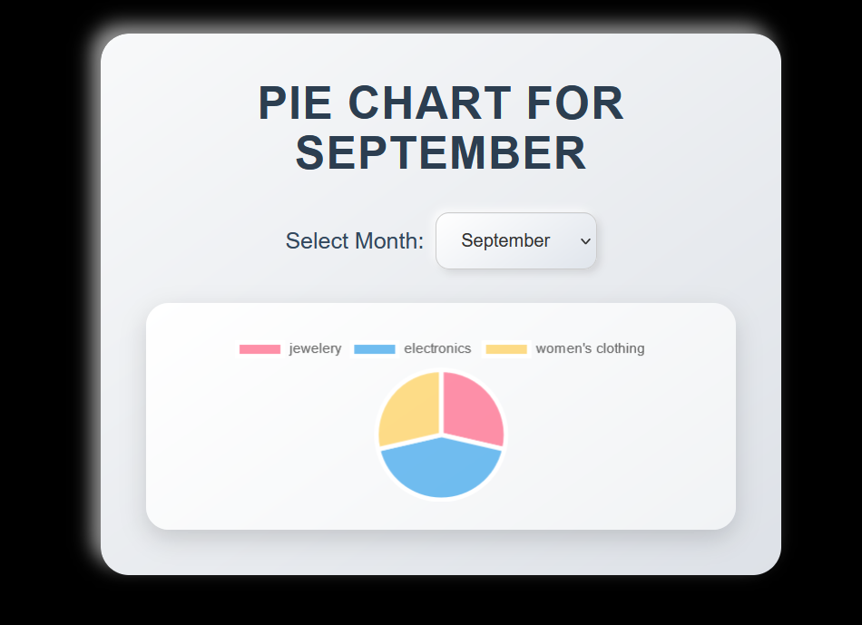

# Transaction_Dashboard
This project is designed to implement a backend API with Node.js, Express, MongoDB (MERN stack), and a frontend using React, to interact with the provided APIs for managing product transactions and displaying various visualizations.

Here is a step-by-step README file for the MERN Stack coding challenge based on the task described:

---

# MERN Stack Coding Challenge

## Overview
This project is designed to implement a backend API with Node.js, Express, MongoDB (MERN stack), and a frontend using React, to interact with the provided APIs for managing product transactions and displaying various visualizations.

## Steps to Complete the Task:


## Features

- **Transactions Table**: Displays product transactions for a selected month with search and pagination support.
- **Statistics API**: Provides statistics on total sale amount, sold items, and unsold items for the selected month.
- **Bar Chart API**: Shows the number of items in specific price ranges for the selected month.
- **Pie Chart API**: Displays the unique categories and the number of items in each category for the selected month.
- **Combined API**: Fetches data from all three APIs (statistics, bar chart, pie chart) and returns a combined response.

## Technologies

### Backend

- **Node.js**
- **Express.js**
- **MongoDB** with Mongoose ORM
- **Axios** for HTTP requests
- **DataTables** for table rendering (client-side)
- **Chart.js** for charts

### Frontend
- **React.js**
- **Axios for API requests**
- **DataTables (using jQuery) for handling table display and pagination**
- **Chart.js for visualizing bar and pie charts**
## Installation

1. Backend Dependencies:
   ```
   cd backend
   npm i or npm install 
   ```
   
2. Frontend dependencies:
   ```
   cd frontend
   cd vite-project
   npm i or npm install 
   ```

## Usage

1. Backend Deploy:
   ```
   cd backend
   npm install express
   node server.js
   ```

2. Frontend Deploy:
   ```
   cd frontend
   cd vite-project
   npm run dev

   ```
## Set up MongoDB connection in .env file:
   ```
     cd backend
     create .env
     MONGO_URI=mongodb://localhost:27017/mern-challenge
     PORT=5000
     API_URL=https://s3.amazonaws.com/roxiler.com/product_transaction.json
  ```

## Screenshots
**Pie Chart Displaying Unique Categories of Selected month**
 

**Bar Chart Displaying Price range and sold items of  Selected month**


**Table Displaying Statistics of Selected month**


**Table Displaying Transactions of  Selected month**


## Contributing

Contributions are welcome! For major changes, please open an issue first to discuss what you would like to change.

#
### Contact

For questions or support, please contact [kadamsonali2147@gmail.com](mailto:kadamsonali2147@gmail.com).

